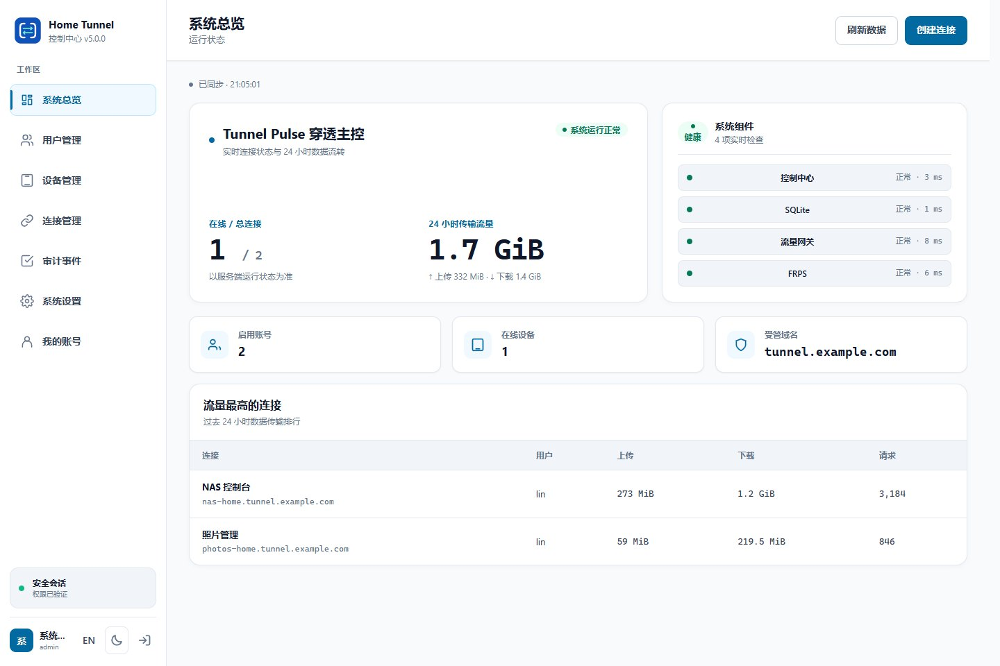

<div align="center">
  
  <h1>Home Tunnel Server</h1>
  <p><strong>Control plane, web console and self-hosted tunnel services</strong></p>
  <p>
    
    <a href="https://github.com/ZHanry/home-tunnel-server/actions/workflows/ci.yml"></a>
    <a href="LICENSE"></a>
  </p>
  <p><a href="README.md">简体中文</a> · <a href="https://zhanry.github.io/home-tunnel/">Project website</a></p>
</div>

The public-server side of Home Tunnel: account and device management, connection policy, a web console, an HTTP gateway, Caddy and FRPS.

> **Internal testing.** Use a separate test environment. Production stability and long-term API compatibility are not promised at this stage.

[Project overview](https://github.com/ZHanry/home-tunnel) · [GUI / CLI client](https://github.com/ZHanry/home-tunnel-client) · [Android app](https://github.com/ZHanry/home-tunnel-android)

## Build a test deployment

Use a public Linux amd64 / arm64 host with Docker Engine, Docker Compose, a domain and DNS for the console and tunnel subdomains. Configure firewall access for HTTP / HTTPS and the FRPS endpoint.

```sh
git clone https://github.com/ZHanry/home-tunnel-server.git
cd home-tunnel-server
sh deploy/scripts/new-selfhost-config.sh   tunnel.example.com 203.0.113.10   console.tunnel.example.com admin@example.com
docker compose -f compose.yaml -f compose.build.yaml config --quiet
docker compose -f compose.yaml -f compose.build.yaml up -d --build
docker compose ps
cat deploy/secrets/bootstrap_admin_password
```

Replace all example values. Open the configured console URL, change the initial administrator password, create a test account and register a device using the desktop or headless client. Start with a simple HTTP service.

## Components and transport

| Component | Purpose |
| --- | --- |
| `control-center/` | REST / WebSocket API, web UI, accounts, devices and leases |
| `traffic-gateway/` | HTTP access policy, proxying, rate limits and traffic samples |
| `deploy/` | Caddy, FRPS and deployment/backup tools |
| `contracts/` | Versioned API fixtures for development |
| `tests/` | Deployment and integration checks |

HTTP / HTTPS uses Caddy and the gateway. Raw TCP and fixed-port UDP require exact administrator-assigned ports and bypass HTTP policy and quotas. Applications must authenticate and encrypt their own raw traffic.

## Development

Use Node.js 24.19.0 and pnpm 11. In each TypeScript service, run `pnpm install --frozen-lockfile`, `pnpm run check`, `pnpm run build` and `pnpm test`. See [contributing](CONTRIBUTING.md) for lint, browser and coverage checks.

See [self-hosting](docs/SELF_HOSTING.md), [architecture](docs/ARCHITECTURE.md), [security model](docs/SECURITY_MODEL.md), [test releases](docs/RELEASING.md) and [private reporting](SECURITY.md).



Licensed under [Apache-2.0](LICENSE).
