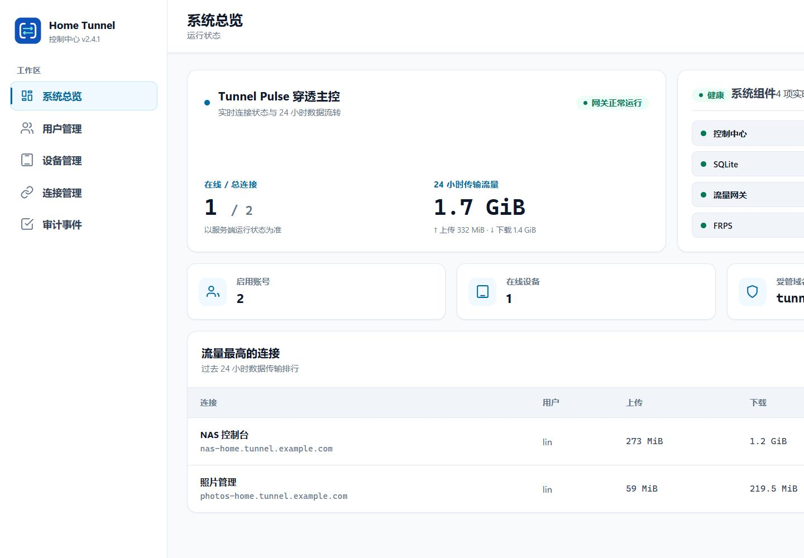

<div align="center">
  
  <h1>Home Tunnel</h1>
  <p><strong>面向个人与家庭服务的自托管内网穿透平台</strong></p>
  <p>Self-hosted tunnels for home services</p>
  <p>
    <a href="https://github.com/ZHanry/home-tunnel/actions/workflows/ci.yml"></a>
    <a href="https://github.com/ZHanry/home-tunnel/actions/workflows/codeql.yml"></a>
    <a href="LICENSE"></a>
  </p>
  <p><a href="https://zhanry.github.io/home-tunnel/">项目网站</a> · <a href="README.en.md">English</a> · <a href="docs/SELF_HOSTING.md">自托管指南</a> · <a href="SECURITY.md">安全报告</a></p>
</div>

Home Tunnel 是面向个人与家庭服务的自托管内网穿透平台，用可审计、可限速、可随时撤销的控制面，安全发布 NAS、Home Assistant 和开发服务。



> `v2.4.1` 是应先独立发布的安全维护版；当前完整源码树面向 `v2.5.0-rc.2`，只有 RC 全矩阵通过并由所有者发布后才可试用。服务端 Linux `amd64`/`arm64` 与 Linux 客户端为 Stable；macOS headless 为 Beta；Windows x64 为 Source/Experimental，暂不提供官方二进制。

## 三步启动

开始前需要一台具有公网地址的 Linux 服务器、一个域名，以及指向服务器的控制台与通配符 DNS 记录。

1. 克隆仓库并生成本地配置：

   ```sh
   git clone https://github.com/ZHanry/home-tunnel.git
   cd home-tunnel
   sh ./deploy/scripts/new-selfhost-config.sh \
     tunnel.example.com \
     203.0.113.10 \
     console.tunnel.example.com \
     admin@example.com
   ```

2. 校验并启动：

   ```sh
   docker compose config --quiet
   docker compose pull
   docker compose up -d
   docker compose ps
   ```

3. 读取一次性管理员密码，访问 `https://console.tunnel.example.com/admin` 并立即改密：

   ```sh
   cat deploy/secrets/bootstrap_admin_password
   ```

完整 DNS、防火墙、备份、回滚与客户端说明见 [自托管指南](docs/SELF_HOSTING.md)。不要将示例域名、示例 IP 或任何 `CHANGE_ME` 值用于公网部署。若要从源码构建镜像，使用 `docker compose -f compose.yaml -f compose.build.yaml up -d --build`。

## 公开支持矩阵

| 组件 | 平台 | 状态 | 分发与限制 |
| --- | --- | --- | --- |
| 服务端 | Linux `amd64` / `arm64` | Stable | 容器与源码构建；稳定版要求完整双架构矩阵 |
| Headless 客户端 | Linux `amd64` / `arm64` | Stable | systemd 服务，实时配置与安全轮询 |
| Headless 客户端 | macOS `amd64` / `arm64` | Beta | launchd 包；仍需扩大真实硬件验证 |
| 图形客户端 | Windows 10/11 x64 | Source / Experimental | 暂无官方二进制或自动更新清单 |

历史 Release 中的自签名 Windows 资产仅用于追溯，属于旧版、不受支持、未知发布者构建。Windows 正式分发只会在可信 Authenticode 证书、受保护签名环境和 Windows 10/11 安装/升级 VM 验证齐备后恢复。

## 为什么不是“裸 FRP”

- **能力受限的 Agent**：只接受控制中心签发且与服务器配置一致的 HTTP/HTTPS、自定义域名和管理员授权 TCP 连接；拒绝通用 FRP 命令、UDP、访客配置和任意插件。
- **集中策略**：用户、设备、连接、短期租约、带宽与状态统一管理，策略撤销会切断活动连接。
- **自动 HTTPS**：Caddy 是唯一公网 Web 入口，按已分配且验证的域名签发证书。
- **访问与流量控制**：IP 允许集、Basic Auth、分层限速、流量聚合和月度配额。
- **可审计运维**：审计事件、组件健康、备份验证、恢复与回滚工具。
- **默认隔离**：SQLite、控制中心和网关不直接发布主机端口；容器使用只读文件系统和最小能力集。

## 工作方式

```text
远程浏览器 ─HTTPS→ Caddy ─→ 流量网关 ─→ FRPS ═受管隧道═→ 家中 Windows/Linux/macOS 主机
管理员     ─HTTPS→ Caddy ─→ 控制中心 ─→ SQLite
Windows/Linux/macOS 客户端 ─REST + WebSocket→ 控制中心
```

控制流和业务流量分离；详细边界见 [架构说明](docs/ARCHITECTURE.md) 与 [安全模型](docs/SECURITY_MODEL.md)。项目不提供公开动态演示站，Pages 中的截图由当前 UI Preview 和真实前端代码生成，示例域名与数据均为本地夹具。

## 客户端

### Linux / macOS

Linux Stable 客户端以 systemd 服务运行；macOS Beta 客户端以 launchd 服务运行。两者通过 WebSocket 接收实时配置通知并保留三分钟安全轮询。构建、安装与注册说明见 [linux-client/README.md](linux-client/README.md)。

### Windows x64（Source / Experimental）

当前不提供官方 Windows 二进制。自行构建的客户端支持图形化登录、连接管理、系统托盘、自动启动和诊断导出；缺失 Windows 专用 `latest.json` 会安全降级为“更新不可用”，不影响隧道。

```powershell
.\windows-client\packaging\build-exe.ps1 `
  -AppId "{{11111111-2222-3333-4444-555555555555}}"
```

开发打包脚本生成的自签名证书不能替代可信发布者签名，也不应公开分发。

## 安全证据

- 控制中心 WebSocket 完整消息上限为 64 KiB，并限制碎片数和缓冲分块；回归覆盖超限、鉴权失败、异常断连、资源回收与重连。
- CI 对生产依赖执行 Moderate 以上审计，并运行 TypeScript、Go、.NET、Compose、契约与文档检查。
- CodeQL 显式分析 JavaScript/TypeScript、Go 与 C#；Secret Scanning 与 Push Protection 应始终保持启用。
- Stable 发布要求同一提交和同一套已验证产物，包含哈希、SBOM、provenance 与签名证据。

不要在公开 Issue 中提交漏洞细节、域名、IP、令牌、密码或日志中的私密信息。请使用 [GitHub 私密漏洞报告](https://github.com/ZHanry/home-tunnel/security/advisories/new)；详细政策见 [SECURITY.md](SECURITY.md)。

## 仓库结构

| 目录 | 内容 |
| --- | --- |
| `control-center/` | REST/WebSocket API、管理后台、FRPS 授权插件 |
| `traffic-gateway/` | Host 授权、反向代理、访问控制、限速与采样 |
| `windows-client/` | Windows WPF 源码与本地打包脚本 |
| `linux-client/` | Linux/macOS headless 客户端及 systemd/launchd 包 |
| `windows-agent/` | 能力受限的 FRP Agent 源码与第三方许可 |
| `contracts/` | 跨组件保留字、配置与协议契约夹具 |
| `deploy/` | Caddy、FRPS、配置、发布、备份和回滚工具 |
| `tests/` | Compose、契约、安装包与端到端验证 |
| `docs/` | 架构、安全、发布、真实截图与静态 Pages |

## 本地验证

要求 Node.js 24 LTS、pnpm、Go 1.26、.NET 10 SDK、Docker Compose，以及重建 Windows Agent 时使用的 `windres`。实际命令以 [CONTRIBUTING.md](CONTRIBUTING.md) 和 CI 为准。

```powershell
Set-Location control-center
pnpm install --frozen-lockfile
pnpm run check
pnpm run build
pnpm test

Set-Location ..\traffic-gateway
pnpm install --frozen-lockfile
pnpm run check
pnpm run build
pnpm test

Set-Location ..
dotnet test .\windows-client-tests\HomeTunnel.Client.Tests.csproj -c Release
```

```sh
cd linux-client
go test -race ./...
go vet ./...
go build ./cmd/home-tunnel-client
```

## 贡献与反馈

小而聚焦、带测试且说明安全影响的 PR 最容易审核。开发约定见 [CONTRIBUTING.md](CONTRIBUTING.md)，发布流程见 [docs/RELEASING.md](docs/RELEASING.md)。真实部署结果请使用 [部署反馈表单](https://github.com/ZHanry/home-tunnel/issues/new?template=deployment_feedback.yml)，不要求公开域名、IP 或凭据。

## 许可证

Home Tunnel 使用 [Apache License 2.0](LICENSE)。内置 Agent 基于 FRP，许可证与第三方声明见 `windows-agent/FRP-LICENSE.txt` 和 `windows-agent/THIRD-PARTY-NOTICES.txt`。
