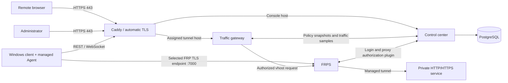

# Architecture

Home Tunnel separates control traffic from proxied application traffic. Caddy is the only public HTTP/TLS entry point; FRPS exposes a separate TCP listener for managed Windows Agents.

## Components

- `control-center/`: authentication, administration, device registration, leases, policy state, optional release display metadata and the web UI.
- `traffic-gateway/`: validates the requested host, enforces policy and rate limits, proxies streams and reports traffic samples.
- `windows-client/`: WPF client for server selection, account login, device state, connection configuration, GitHub-hosted updates and diagnostics.
- `windows-agent/`: capability-restricted FRP client. It requires the generated configuration to match the server profile explicitly selected in the Windows client.
- `deploy/frps/`: FRPS image and authorization-plugin configuration.
- `compose.yaml`: portable source-build deployment including PostgreSQL and Caddy.
- `deploy/`: production-oriented ARM64 release, backup, smoke-test and rollback tooling retained for the original deployment profile.

## Control flow

1. An administrator creates a user, device and connection policy.
2. The Windows client authenticates, registers the device and receives a short-lived signed lease plus its allowed HTTP connections.
3. The managed Agent validates the generated FRP configuration against the HTTPS server profile selected by the user before starting.
4. FRPS asks the control center to authorize Agent login and proxy creation.
5. Caddy asks the control center before obtaining an on-demand certificate for a hostname.
6. The traffic gateway resolves the hostname to an active policy before forwarding the request to FRPS.

The design intentionally does not expose PostgreSQL, the control-center container or the traffic-gateway container directly on host ports.
