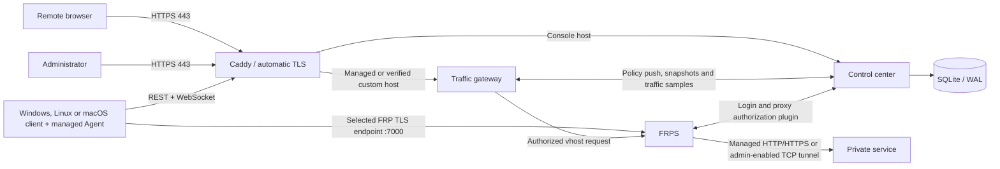

# Architecture

Home Tunnel separates control traffic from proxied application traffic. Caddy is the only public HTTP/TLS entry point; FRPS exposes a separate TCP listener for managed Windows, Linux and macOS Agents.

## Components

- `control-center/`: authentication, administration, device registration, leases, policy state, optional release display metadata and the web UI.
- `traffic-gateway/`: validates managed and DNS-verified custom HTTP hosts, enforces policy and rate limits, proxies streams and reports traffic samples.
- `windows-client/`: Experimental WPF client distributed as a self-signed x64
  EXE for server selection, account login, device state, connection
  configuration, GitHub-hosted updates, and diagnostics.
- `linux-client/`: headless Go control process for enrollment, device authentication, WebSocket sync with polling fallback, lease renewal, heartbeat, Agent supervision, Linux systemd packaging and Beta macOS launchd packaging.
- `windows-agent/`: shared capability-restricted FRP Agent source. Windows, Linux and macOS builds require generated configuration to match the server profile selected during client enrollment.
- `deploy/frps/`: FRPS image and authorization-plugin configuration.
- `compose.yaml`: portable deployment using prebuilt multi-architecture images, SQLite and Caddy; `compose.build.yaml` opts into local source builds and `deploy/compose.tcp.yaml` explicitly enables/publishes the administrator-selected TCP port range.
- `deploy/`: production-oriented ARM64 release, backup, smoke-test and rollback tooling retained for the original deployment profile.

## Control flow

1. An administrator creates a user, device and connection policy. A user can bind a custom HTTP domain after both DNS TXT ownership and CNAME target checks; only an administrator can create a TCP connection and assign its public port.
2. The Windows, Linux or macOS client authenticates, registers the device and receives a short-lived signed lease plus its allowed HTTP/custom-domain/TCP connections.
3. The managed Agent validates the generated FRP configuration against the HTTPS server profile selected by the user before starting.
4. FRPS asks the control center to authorize Agent login and proxy creation.
5. Caddy asks the control center before obtaining an on-demand certificate for a managed or verified custom hostname.
6. Policy changes notify the traffic gateway over an authenticated server-sent-event stream; a five-minute full sync remains as recovery.
7. The traffic gateway resolves each HTTP hostname to an active policy before forwarding it to FRPS. Administrator-enabled raw TCP uses a fixed FRPS allow-port range and bypasses the HTTP gateway by design.

The design intentionally does not expose the SQLite volume, control-center container or traffic-gateway container directly on host ports.
