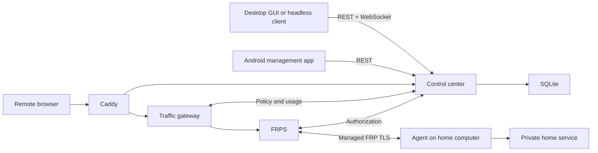

# Architecture

The server separates control traffic from application traffic. Caddy terminates public HTTP/TLS.
The control center owns users, devices, short-lived leases, connection policy and the web console.
The traffic gateway enforces HTTP policy and reports traffic samples. FRPS handles managed tunnels
and explicitly allocated TCP/UDP ports. SQLite and internal service ports remain private.

GUI, CLI, shared client core and restricted Agent source are maintained together in
`ZHanry/home-tunnel-client`. Android is a remote management application and does not host
a local tunnel or package a native Agent. Server builds use neither client source checkout.

`contracts/` owns the versioned protocol fixture; consumers pin and vendor it. Changes to
authentication, leases, sync fields or realtime events must maintain the documented API
compatibility or introduce an explicit new version. TCP/UDP policy still requires exact
administrator-assigned ports; raw traffic bypasses the HTTP gateway and its quotas.
