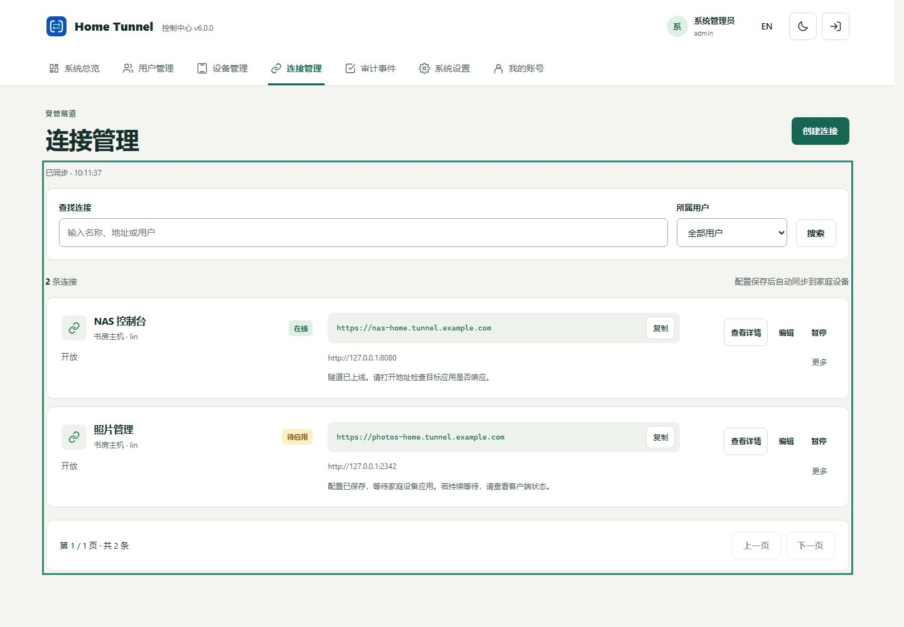

# 管理后台界面验证

界面以开发环境和测试数据验证。浏览器测试不能代替真实隧道、移动设备或长时间运行检查。

## 主要场景

| 场景 | 验证内容 |
| --- | --- |
| 公共首页与登录 | 下载入口、控制台返回链接、失效会话 |
| 主题与语言 | 一次点击只切换一次，用户资源名称保持原样 |
| 连接表单 | 字段错误、非敏感草稿保留、重复提交防护 |
| 多资源编辑 | 同名资源的草稿隔离，保存冲突后的恢复 |
| 后台刷新 | 不覆盖正在编辑的输入与焦点 |
| 权限 | 普通账号的设备、连接与配额归属 |
| 响应式布局 | 不同视口下的卡片、导航与键盘焦点 |
| 组件状态 | 区分未知、失败与健康状态，提供实际错误反馈 |

## 执行

在 `control-center/` 安装依赖与 Playwright Chromium 后执行 `pnpm run test:browser`。
配套服务测试覆盖接口行为与数据约束。桌面页面和 Android 交互分别在对应代码仓库维护。

