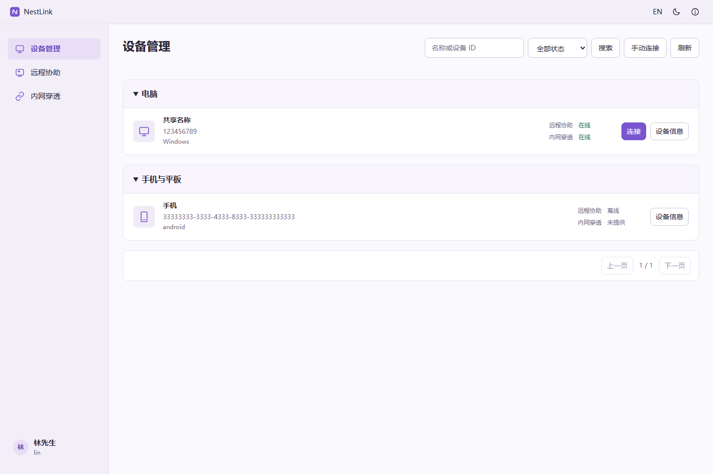
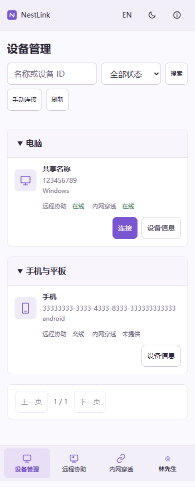

# 管理后台界面验证

界面以开发环境和测试数据验证。浏览器测试不能代替真实隧道、移动设备或长时间运行检查。

## 主要场景

| 场景 | 验证内容 |
| --- | --- |
| 公共首页与登录 | 下载入口、控制台返回链接、失效会话 |
| 主题与语言 | 一次点击只切换一次，用户资源名称保持原样 |
| 连接表单 | 字段错误、非敏感草稿保留、重复提交防护 |
| 多资源编辑 | 同名资源的草稿隔离，保存冲突后的恢复 |
| 后台刷新 | 不覆盖正在编辑的输入与焦点 |
| 权限 | 普通账号的设备、连接与配额归属 |
| 响应式布局 | 不同视口下的卡片、导航与键盘焦点 |
| 组件状态 | 区分未知、失败与健康状态，提供实际错误反馈 |

## 执行

在 `control-center/` 安装依赖与 Playwright Chromium 后执行 `pnpm run test:browser`。
配套服务测试覆盖接口行为与数据约束。桌面页面和 Android 交互分别在对应代码仓库维护。

## 当前界面与截图

当前文档使用 NestLink 14.0.0 的真实网页界面。截图清单见 [14.0.0 manifest](assets/14.0.0/manifest.json)，记录网页源码文件 SHA-256、PNG 原始字节 SHA-256、视口、主题、页面和采集时间。截图来自本地 Chromium 与 `ui-preview.mjs` 示例账号、设备及服务数据；设备分组截图由 `nestlink14.spec.mjs` 提供明确 GUI/background 关联和 Android 设备样例。

设备目录展示电脑、手机与平板以及各能力状态；远程协助和内网穿透各自独立管理，账号页集中管理员工具。浏览器在 320、390、768、1440px 检查目录与较大控件文字，在 390、1280、1440、1920、2560px 检查全部页面及弹窗布局，覆盖浅色与深色。较大控件文字检查不代表整页 200% 字体缩放验收。

主题切换回归在首帧检查可用次要按钮的文字对比度至少为 4.5:1；手机页面滚动到底后，最后一张设备卡片和分页操作均完整位于固定底栏上方。

浏览器内远控需要实际登录的 Windows 或 Linux 设备批准或验证密码。截图本身不作为媒体、输入或穿透验收证据。
