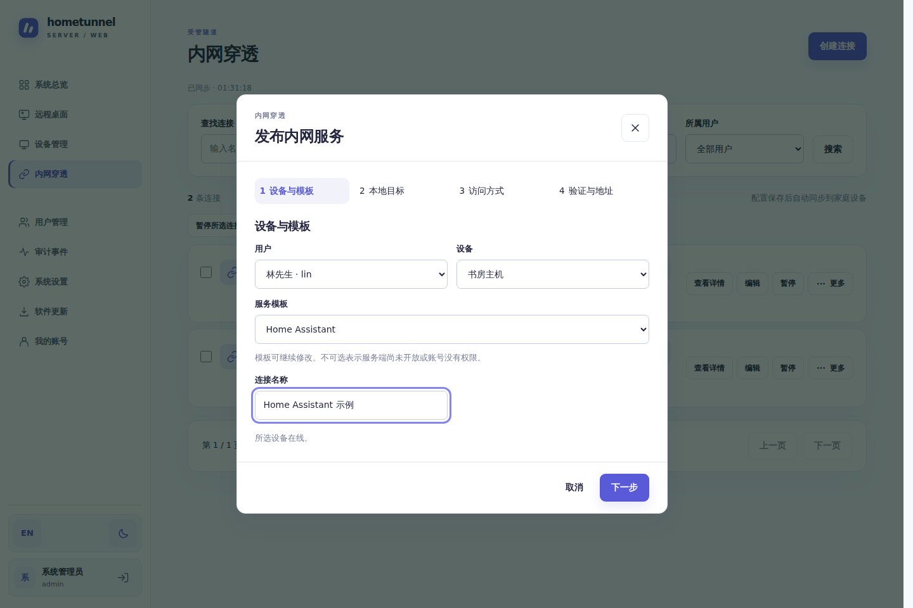
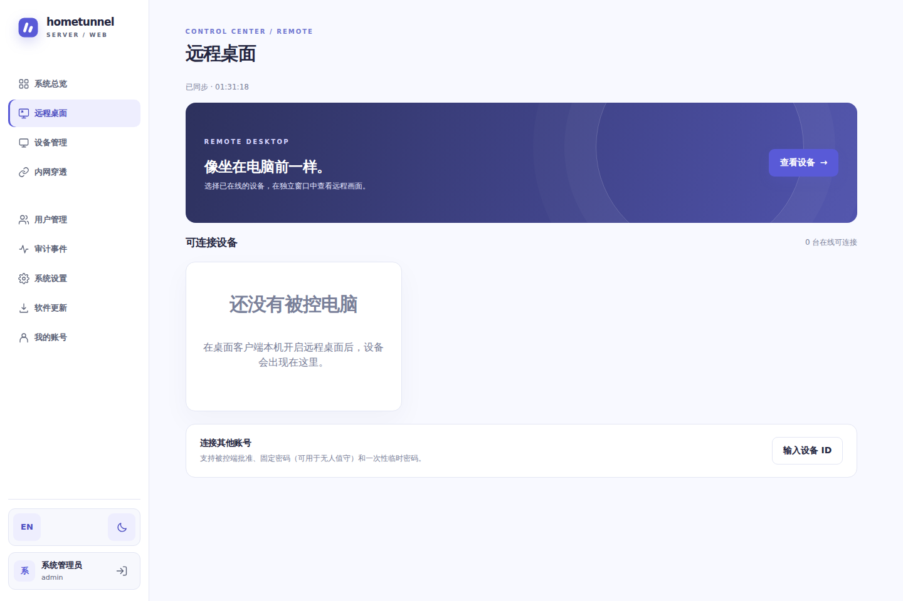

# 管理后台界面验证

界面以开发环境和测试数据验证。浏览器测试不能代替真实隧道、移动设备或长时间运行检查。

## 主要场景

| 场景 | 验证内容 |
| --- | --- |
| 公共首页与登录 | 下载入口、控制台返回链接、失效会话 |
| 主题与语言 | 一次点击只切换一次，用户资源名称保持原样 |
| 连接表单 | 字段错误、非敏感草稿保留、重复提交防护 |
| 多资源编辑 | 同名资源的草稿隔离，保存冲突后的恢复 |
| 后台刷新 | 不覆盖正在编辑的输入与焦点 |
| 权限 | 普通账号的设备、连接与配额归属 |
| 响应式布局 | 不同视口下的卡片、导航与键盘焦点 |
| 组件状态 | 区分未知、失败与健康状态，提供实际错误反馈 |

## 执行

在 `control-center/` 安装依赖与 Playwright Chromium 后执行 `pnpm run test:browser`。
配套服务测试覆盖接口行为与数据约束。桌面页面和 Android 交互分别在对应代码仓库维护。

## 10.0.0 界面截图 / UI screenshots

以下截图来自服务端 `v10.0.0` 的实际 Web 界面，使用仓库自带预览服务的示例数据，未修改产品 UI 源码。截图用于说明界面，不代表生产服务健康、真实隧道或远程会话已经验证。

These screenshots show the actual server `v10.0.0` Web UI with example data from the repository's preview service. Product UI source is unchanged. The screenshots illustrate the interface; they do not establish production health, working tunnels, or a verified remote session.

### 系统总览 / Dashboard

设备数、流量及组件状态均为预览示例值。Device counts, traffic, and component health are preview example values.

### 发布内网服务 / Publishing wizard

展示“设备与模板”步骤，未提交或发布真实连接。The capture shows the device-and-template step; no real connection was submitted or published.

### 远程桌面入口 / Remote desktop entry

预览启用了远程桌面入口，但设备列表为空；这不是 Windows 原生客户端或实际远控会话截图。The preview enables the remote entry with an empty device list. This is not a native Windows client capture or a live remote-control session.

截图于 2026-09-30 UTC 生成，源提交为 [`9e5b4ff4e6381a42317c94618d1805b7398c558e`](https://github.com/ZHanry/home-tunnel-server/commit/9e5b4ff4e6381a42317c94618d1805b7398c558e)。原始 PNG、SHA-256 与采集参数见[原始清单 / original manifest](assets/v10.0.0/manifest.json)；[来源与复核说明 / provenance and visual review](assets/v10.0.0/README.md)说明示例数据与截图范围。
